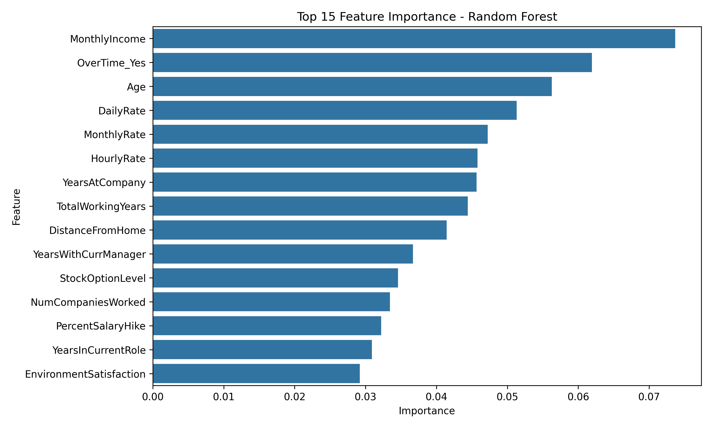

# HR Attrition Analysis

This project analyzes employee attrition in a company using the IBM HR Analytics dataset.

## Visual results

These visuals bring together workforce patterns, attrition comparisons, key model signals, and evaluation results to support focused HR follow-up.

### Workforce age distribution
Shows the age profile of the workforce, adding demographic context to retention patterns.

### Attrition by business travel
Compares exits by business-travel frequency, helping assess how travel demands relate to retention.

### Attrition by department
Shows attrition counts across departments to identify where departures are concentrated.

### Attrition by education field
Breaks out attrition by education field, revealing whether retention patterns differ by background.

### Attrition by job role
Compares attrition across job roles so role-specific retention priorities are visible.

### Attrition by marital status
Compares departures across marital-status groups, adding a workforce-segment view to the analysis.

### Attrition by overtime
Contrasts attrition for employees with and without overtime, informing workload and burnout reviews.

### Attrition rate by department
Normalizes department attrition as a percentage, making rates easier to compare across team sizes.

### Logistic Regression confusion matrix
Shows class-level correct and incorrect predictions to expose where the Logistic Regression model misses attrition cases.

### Test-model confusion matrix
Summarizes test-model predictions by class, making false positives and missed leavers visible.

### Feature correlation map
Maps pairwise feature relationships, helping distinguish correlated signals and potential redundancy.

### Feature importance
Ranks influential model features to focus follow-up analysis on the strongest attrition signals.

### Random Forest feature importance
Shows Random Forest feature rankings, supporting the project's driver analysis and HR recommendations.

### Income by attrition status
Compares income by attrition outcome, testing whether compensation patterns align with employee departures.

### Logistic Regression coefficients
Shows signed Logistic Regression coefficients, clarifying how predictors shift modelled attrition risk.

### Monthly income distribution
Displays income distributions by attrition status, including spread and outliers beyond average pay.

### Logistic Regression ROC curve
Evaluates the Logistic Regression model's ability to distinguish leavers across decision thresholds.

### Test-model ROC curve
Evaluates the test model's ability to distinguish leavers across decision thresholds.

##  Goals
- Identify which departments experience the highest attrition rates
- Visualize attrition percentage by department
- Provide actionable insights for HR strategy

##  Technologies Used
- Python
- Pandas
- Matplotlib
- Seaborn

##  Key Insights
- The **Sales department** has the highest attrition rate (~20%)
- **Human Resources** also shows high turnover compared to other areas
- R&D has the **lowest attrition**, suggesting higher stability

##  Dataset
- [IBM HR Analytics Dataset](https://www.kaggle.com/datasets/pavansubhasht/ibm-hr-analytics-attrition-dataset)

---

## 2 – Visual Analysis by Department

We visualized attrition rates by department to identify where turnover is most critical.

### Key Findings:
- **Sales** has the highest attrition rate (~20%), indicating a need for targeted HR interventions.
- **Human Resources** also shows elevated attrition compared to R&D.
- **R&D** appears the most stable department overall.

---

## 3 – Correlation Insights

- Strong positive correlation between `JobLevel` and `MonthlyIncome` (~0.95): higher-level employees earn more.
- `TotalWorkingYears` strongly correlates with `Age` (~0.78): older employees have more experience.
- `EnvironmentSatisfaction`, `JobSatisfaction`, and `WorkLifeBalance` show low correlations with other features – suggesting independent psychological dimensions.

---

## 4 – Machine Learning Model

- **Model used:** Logistic Regression
- **Accuracy achieved:** ~88%
- **Limitation:** High class imbalance; only ~16% of employees actually leave
- **Adjusted model:** Used `class_weight="balanced"` to improve fairness
- **Outcome:** Precision and recall on attrition improved, even if accuracy dropped

## 4b – Feature Importance Insights

Using a Random Forest model, we identified the most influential variables in employee attrition.

### Top Influential Features (Random Forest):

1. **MonthlyIncome** – Lower salaries correlate with higher attrition
2. **OverTime** – Frequent overtime increases attrition risk
3. **Age** – Younger employees are more likely to leave
4. **DistanceFromHome** – Long commute contributes to dissatisfaction
5. **YearsAtCompany** – New employees are more likely to quit

### HR Recommendations:
- Limit excessive overtime to reduce burnout
- Offer competitive early-career salary packages
- Improve onboarding and mentorship for new hires
- Consider hybrid work or transportation support for distant workers

## Next Steps

- Apply more advanced models like XGBoost
- Use cross-validation and SMOTE to handle imbalance
- Build an interactive dashboard to present insights
